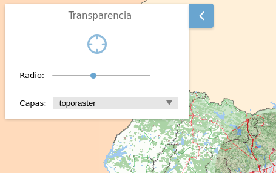

# M.plugin.Transparency

Plugin que permite aplicar un efecto de transparencia a las capas seleccionadas.



# Dependencias

- transparency.ol.min.js
- transparency.ol.min.css


```html
 <link href="../../plugins/transparency/transparency.ol.min.css" rel="stylesheet" />
 <script type="text/javascript" src="../../plugins/transparency/transparency.ol.min.js"></script>
```

# Parámetros

- El constructor se inicializa con un JSON de options con los siguientes atributos:

- **layers**. String que contiene el nombre de las capas que se quieren seleccionar del mapa. A estas capas se les aplicará el filtro de transparencia.

- **position**. Indica la posición donde se mostrará el plugin.
  - 'TL':top left
  - 'TR':top right (default)
  - 'BL':bottom left
  - 'BR':bottom right

- **radius**. Campo numérico que modifica el radio del efecto transparencia. Tiene un rango entre 30 y 200.

# Eventos

# Otros métodos

# Ejemplos de uso

```javascript
   const map = M.map({
     container: 'map'
   });

   const mp = new M.plugin.Transparency({
        layers: '',
        postition: 'TL',
      });

   map.addPlugin(mp);
```

```javascript
const mp = new Transparency({
  layers: 'provincias,fondo,Sevilla',
  radius: 150,
});

map.addPlugin(mp);
```

```javascript
const mp = new Transparency({});

map.addPlugin(mp);
```
